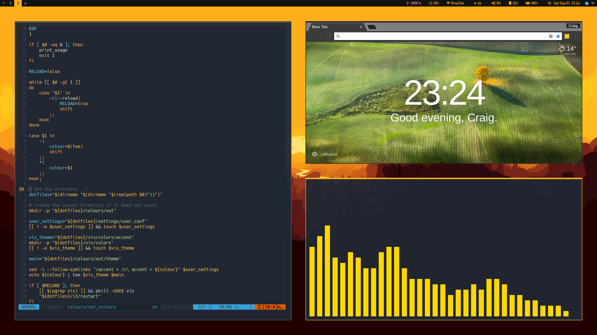
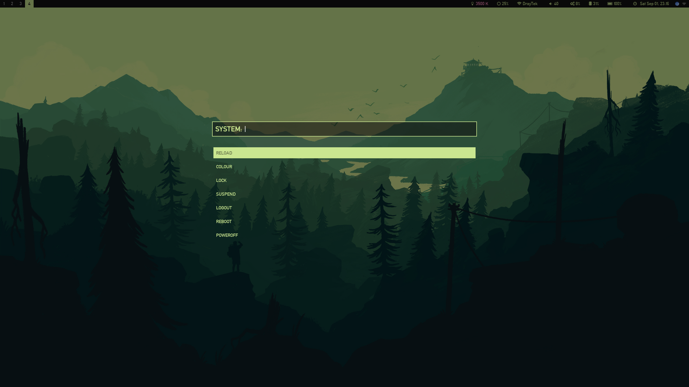
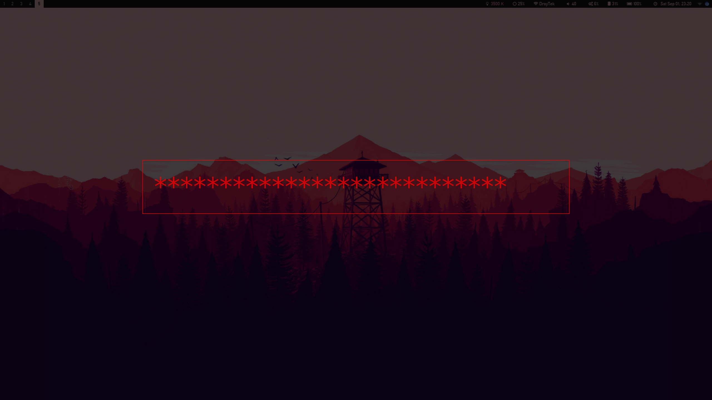

# Dotfiles

 
 
 

Configuration files for various programs. Managed by GNU [stow][https://www.gnu.org/software/stow/].

This repository currently contains configuration for the following programs:

| Program | Description |
| --- | --- |
| `alacritty` | Currently my preferred terminal. GPU-accelerated and very pretty. Now with scrollback buffer by default! |
| `bash` | Configuration for the `/bin/bash` shell, setting up aliases and environment variables. |
| `compton` | Compositor for Xorg. Handles window transparency. |
| `dunst` | Notification daemon with HTML-style formatting. |
| `emacs` | My currently preferred text-editor for project-level work. I highly recommend [spacemacs](https://github.com/syl20bnr/spacemacs) if you're a vim user. |
| `git` | Alises and custom command configuration. I like the idea of using git for [other stuff too](https://github.com/CraigFe/trace-rpc)! |
| `i3` | Tiling window manager. I switched over to `xmonad` a while ago when my i3 config started getting ridiculous to maintain. |
| `LaTeX` | Document preparation and typesetting. |
| `mutt` | Text-based email client for the command line. |
| `polybar` | Status bar to replace i3status with something a bit more customisable. |
| `ranger` | Terminal file explorer. |
| `redshift` | Adjusts the colour temperature of the screen according to the surroundings. |
| `rofi` | Custom prompts and program launcher using my own themes (replacement for `dmenu`). |
| `tmux` | Terminal multiplexer. I don't use the multiplexing (`xmonad` is better for this), but detaching from remote sessions is cool. |
| `(neo)vim` | Gradually being phased out in favour of spacemacs. |
| `vis` | Music spectrum visualiser. |
| `xmonad` | Tiling window manager. Uses a Haskell configuration file format. Alright if you like that sort of thing. |
| `Xserver` | Windowing system on bitmap displays. |
| `zathura` | My PDF viewer of choice. |
| `zsh` | Shell with fancier features than `bash`. |

There are also a number of setup scripts in the `/setup` directory.

